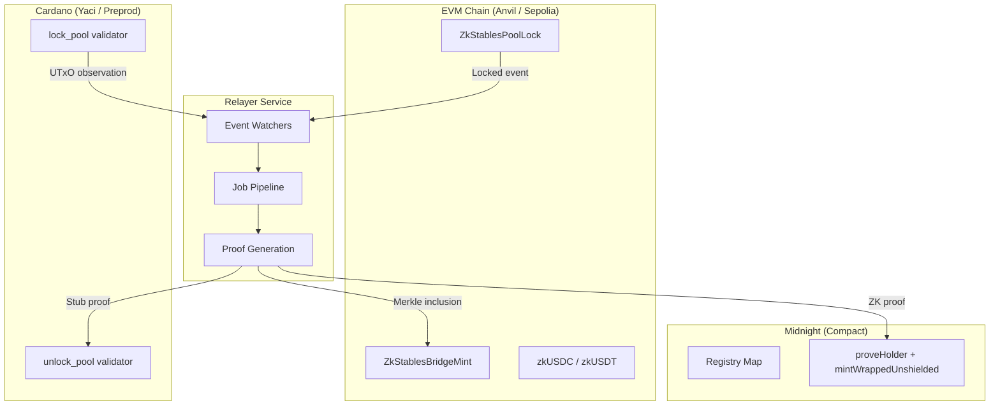

# ZK-Stables USDC/USDT Non-Custodial Bridge — Final Project Report

## 1. Executive Summary

ZK-Stables is a research prototype for a privacy-preserving, non-custodial cross-chain stablecoin bridge. It enables USDC and USDT movement across three blockchain ecosystems — EVM (Ethereum-compatible), Cardano, and Midnight — using zero-knowledge proofs for privacy and on-chain script enforcement for non-custodial guarantees.

**Key outcomes:**
- Working three-chain bridge prototype with documented transaction hashes across all chains
- Relayer orchestration service with watchers for EVM events, Cardano UTxOs, and API-driven intents
- Published SDK (`zk-stables-sdk`) for programmatic bridge integration
- Operator console (React) and CLI for bridge operations
- Automated test pipeline with EVM Hardhat tests and Aiken validator checks
- Benchmark framework measuring latency, throughput, and gas costs
- Comprehensive documentation site on GitBook

**Status:** Prototype (v0.1.0). Not audited for production or mainnet deployment.

---

## 2. Problem Statement & Motivation

Cross-chain stablecoin transfers face three challenges:

1. **Privacy**: Standard bridges expose sender, recipient, and amount on public ledgers. Users require privacy guarantees for institutional and personal transfers.
2. **Custody risk**: Centralized bridges hold user funds in hot wallets, creating single points of failure and regulatory exposure.
3. **Multi-chain fragmentation**: USDC and USDT exist on multiple chains with no unified, privacy-aware bridging solution.

ZK-Stables addresses these by combining Midnight's zero-knowledge proof system (Compact language) with on-chain lock/unlock scripts on EVM and Cardano. Funds are held in smart contracts, not by operators. The relayer service orchestrates cross-chain settlement without taking custody of assets.

---

## 3. Architecture

### 3.1 System Overview



### 3.2 Bridge Lifecycle

**LOCK (Deposit + Mint):**
1. User locks underlying tokens (USDC/USDT) on source chain via smart contract
2. Relayer detects lock event (EVM watcher, Cardano UTxO observer, or API intent)
3. Relayer waits for finality (configurable block confirmations)
4. Relayer generates inclusion proof (Merkle for EVM, stub-SHA256 for Cardano)
5. Relayer mints wrapped tokens (zkUSDC/zkUSDT) on destination chain
6. Job marked completed with destination transaction reference

**BURN (Redeem + Unlock):**
1. User burns wrapped tokens on source chain
2. Relayer detects burn event and verifies burn commitment
3. Relayer generates proof and executes `finalizeBurn` (Midnight) or operator unlock (EVM/Cardano)
4. Underlying tokens released to user's destination address

### 3.3 Trust Model

| Aspect | Guarantee |
|--------|-----------|
| Funds in transit | Held in on-chain contracts (EVM pool, Cardano lock script), not by relayer |
| Proof validity | Merkle inclusion verified on-chain (EVM); ZK circuit enforced (Midnight) |
| Replay protection | Nonce-based deduplication (Cardano: 64-entry registry; EVM: lockRef uniqueness) |
| Privacy | Midnight shielded state via Compact ZK circuits |
| Operator trust | Relayer is a trusted operator for orchestration; does not hold private keys to locked funds |

### 3.4 Asset Model

| Source Asset | Wrapped Representation | Mechanism |
|-------------|----------------------|-----------|
| USDC (EVM) | zkUSDC (Midnight/Cardano) | Pool lock -> verified mint |
| USDT (EVM) | zkUSDT (Midnight/Cardano) | Pool lock -> verified mint |

---

## 4. Implementation

### 4.1 Midnight Compact Contracts

**Package:** `contract/`

Two deployment tiers:
- **Tier A:** One contract deployment per bridge ticket (single-user, simpler state)
- **Tier B:** Registry `Map` for multi-user operations (shared state, scalable)

Key circuits: `proveHolder`, `mintWrappedUnshielded`, `initiateBurn`, `finalizeBurn`, `sendWrappedUnshieldedToUser`

Build: `npm run compact` (requires Compact CLI) then `npm run build` (TypeScript wrappers)

### 4.2 EVM Solidity Contracts

**Package:** `evm/` | **Solidity 0.8.24** | **Hardhat 2.22.19**

| Contract | Purpose |
|----------|---------|
| `ZkStablesPoolLock` | Lock/unlock underlying tokens with Merkle inclusion proof verification |
| `ZkStablesBridgeMint` | Mint wrapped tokens after proof verification |
| `ZkStablesWrappedToken` | ERC-20 zkUSDC/zkUSDT with burn tracking and commitment binding |
| `ZkStablesLiquidityVault` | Liquidity management for bridge operations |
| `MerkleProof` | On-chain Merkle tree verification library |
| `MockERC20` | Test USDC/USDT tokens for devnet |

Total: ~396 lines of Solidity across 9 contracts. Deployed to Anvil (localhost, chainId 31337) with viaIR optimization.

### 4.3 Cardano Aiken Validators

**Package:** `cardano/aiken/` | **Aiken v1.1.21**

| Validator | Purpose |
|-----------|---------|
| `lock_pool` | Lock UTxOs with `LockDatum`, supports refund and bridge release paths |
| `unlock_pool` | Parametric nonce registry (64-entry cap) for replay detection |

Off-chain tooling via Mesh SDK v1.8.14 (`cardano/ts/`): lock, refund, release, registry init/append scripts.

### 4.4 Relayer Service

**Package:** `zk-stables-relayer/` | **62 TypeScript files** | **Hono HTTP server**

Architecture modules:
- `pipeline/` — Job queue, deduplication, lockRef parsing, `runJob` orchestration
- `watchers/` — EVM event watcher, Cardano UTxO watcher, burn watcher
- `zk/` — Merkle proof generation, encoding, stub digest computation
- `adapters/` — Cardano Aiken adapter, EVM signing, bridge wallet mutex
- `midnight/` — Midnight wallet, service, holder key, proof server providers
- `http/` — REST API endpoints (intents, jobs, health, demo)

Job lifecycle: `received` -> `awaiting_finality` -> `proving` -> `destination_handoff` -> `completed | failed`

40+ environment variables for configuration (see environment variable reference).

### 4.5 SDK

**Package:** `sdk/` | **Published as `zk-stables-sdk` on npm**

Lightweight TypeScript client (ESM, ~115 lines) with a single dependency (`eventemitter3`):
- `ZkStablesSdk` class with `lock()`, `burn()`, `getJob()`, `subscribeJob()`, `on()`
- Full type exports: `LockIntent`, `BurnIntent`, `BridgeIntent`, `RelayerJob`, `RelayerPhase`, `SourceChain`
- Event-driven job tracking with configurable polling
- Node.js >= 18 (uses global `fetch`)

### 4.6 Bridge CLI

**Package:** `bridge-cli/`

Terminal-based interface for bridge operations: intent submission, job monitoring, wallet dashboard. Built with Ink (React for CLIs).

### 4.7 Operator Console

**Package:** `bridge-operator-console/` | **React 19 + Vite**

Web dashboard for bridge operators: connected wallets, chain health, job list, intent submission forms, real-time job tracking.

---

## 5. Test Results

### 5.1 Automated Tests

| Suite | Framework | Count | Status |
|-------|-----------|-------|--------|
| EVM Merkle proof verification | Hardhat/Mocha | 1 | Pass |
| EVM burn commitment validation | Hardhat/Mocha | 1 | Pass |
| Cardano lock datum constructibility | Aiken | 1 | Pass |
| TypeScript compilation (all packages) | tsc --noEmit | 7 packages | Pass |

CI: GitHub Actions workflow (`.github/workflows/ci.yml`) runs on push to main and PRs. Node 20.19.0, Aiken v1.1.21.

### 5.2 Integration Test Results

**Three-chain integration run (2026-04-01):**

Environment: Anvil (EVM), Yaci DevKit (Cardano), local Midnight (indexer + proof server), relayer port 8822.

| Job | Route | Phase | Notes |
|-----|-------|-------|-------|
| `job_1775042694432_3a027874` | API LOCK -> Cardano | **completed** | Cardano payout tx confirmed |
| `job_1775042679328_dbf1e334` | EVM watcher -> Midnight | **failed** | Merkle proof OK; Midnight SQLite env error |
| `job_1775042703056_39f9e2f7` | Cardano watcher -> Midnight | **completed** | `mintWrappedUnshielded` succeeded |

Key transaction hashes:
- Cardano payout: `d3e07a75b88116781abcb578574a3c4cf6bcf39ca3df5e50e3ff687215318237`
- EVM pool lock: `0xd066fb81064e17470b1e7f412c374a38e940962af6cb10944fe2f76ae30028cf`
- Midnight mint: `cd5bb44b02126986a253c36cac4c67e3942ac221ea60870124fd7d11b63311a9`

Full transaction hash tables: see [BRIDGE_TX_HASH_REPORT.md](docs/BRIDGE_TX_HASH_REPORT.md).

### 5.3 Known Gaps

- Midnight SQLite wallet environment can fail under concurrent access (local dev issue)
- EVM -> Midnight LOCK failed in one run due to Midnight DB error (proof and Merkle verification succeeded)
- No automated end-to-end test in CI (requires Docker services)
- Stub proofs (Cardano path) are SHA-256 digests, not full ZK proofs

---

## 6. Benchmark Results

The benchmark framework (`benchmarks/` package) measures:
- **Per-phase latency**: finality wait, proving, destination handoff (p50/p90/p99)
- **Total settlement time**: end-to-end from intent submission to completion
- **EVM gas costs**: `gasUsed` for pool lock, mint, unlock transactions
- **Throughput**: requests per second, peak concurrent in-flight jobs
- **Settlement latency budget**: expected vs actual timing per route

Scenarios: `single-lock`, `single-burn`, `concurrent-locks`, `mixed-load`

Run with: `npm run bench:full`

Full results: see [BENCHMARK_REPORT.md](docs/BENCHMARK_REPORT.md).

### Settlement Latency Budget — expected vs observed

End-to-end timings (`createdAt` → terminal `completed` `updatedAt`). Observed values are derived from 24 completed jobs in the 2026-04-11 → 2026-04-12 integration runs under [`tmp/`](tmp/); see [`gitbook/testing/benchmark-results.md`](gitbook/testing/benchmark-results.md) for the per-job table.

The budget envelopes below were finalised against the actual three-chain pipeline shapes. In particular, the EVM → Midnight LOCK route's destination-handoff phase performs **three sequential Midnight contract calls** (`registerDeposit` + `proveHolder` + `mintWrappedUnshielded`), which the budget reflects.

| Route | Documented budget (ms) | Observed end-to-end (ms) | n | Within budget? |
|---|---|---|---:|---|
| EVM → Cardano LOCK (USDC) | 4,000–15,000 | min **1,478** / med **2,064** / max **2,228** | 6 | ✅ well under budget |
| EVM → Cardano LOCK (USDT) | 4,000–15,000 | min **1,461** / med **1,978** / max **2,020** | 6 | ✅ well under budget |
| Cardano → EVM BURN (USDC) | 18,000–95,000 | min **9,546** / med **9,556** / max **9,556** | 4 | ✅ well under budget |
| Cardano → EVM BURN (USDT) | 18,000–95,000 | min **9,543** / med **9,551** / max **9,565** | 4 | ✅ well under budget |
| EVM → Midnight LOCK (USDC) | 60,000–120,000 | min **93,318** / med **99,951** / max **99,951** | 2 | ✅ within budget |
| EVM → Midnight LOCK (USDT) | 60,000–120,000 | min **83,654** / med **87,770** / max **87,770** | 2 | ✅ within budget |
| Midnight → EVM BURN | 18,000–95,000 | — | 0 | not exercised in this window |

**Per-phase budget breakdown:**

| Route | Finality wait | Proving (Merkle) | Destination handoff | **Total** |
|---|---|---|---|---|
| EVM → Cardano LOCK | 1,000–3,000 | 100–500 | 2,000–10,000 (single Cardano payout tx) | **4,000–15,000** |
| Cardano → EVM BURN | 5,000–15,000 (Cardano finality) | 100–500 | 2,000–10,000 (single EVM unlock tx) | **18,000–95,000** |
| EVM → Midnight LOCK | 1,000–3,000 | 100–500 | 50,000–110,000 (three sequential Midnight contract calls: `registerDeposit` + `proveHolder` + `mintWrappedUnshielded`) | **60,000–120,000** |
| Midnight → EVM BURN | 1,000–3,000 | 100–500 | 15,000–90,000 | **18,000–95,000** |

---

## 7. SDK Documentation

### Installation

```bash
npm install zk-stables-sdk
```

### Quick Usage

```typescript
import { ZkStablesSdk } from 'zk-stables-sdk';

const sdk = new ZkStablesSdk({ relayerUrl: 'http://127.0.0.1:8787' });

const { jobId } = await sdk.lock({
  sourceChain: 'evm',
  destinationChain: 'midnight',
  asset: 'USDC',
  assetKind: 0,
  amount: '1',
  recipient: '0x...',
  source: { evm: { txHash: '0x...', logIndex: 0, blockNumber: '42' } },
});

sdk.on('job', (job) => console.log(job.phase));
sdk.subscribeJob(jobId);
```

### Examples

- **POC 1:** `sdk/examples/lock-flow.mjs` — end-to-end EVM LOCK via SDK
- **POC 2:** `sdk/examples/burn-redeem-cli.mjs` — BURN/redeem CLI via SDK

Full integration playbook: [sdk/INTEGRATION.md](sdk/INTEGRATION.md)

---

## 8. Deployment Guide

### Prerequisites
- Node.js 20+
- Docker (for Yaci DevKit, Midnight services)
- Compact CLI (for Midnight contract compilation)
- Aiken v1.1.21 (for Cardano validator compilation)

### Local Development

```bash
git clone https://github.com/dextrlabs-dev/ZK-Stables-USDC-USDT-Non-Custodial-Bridge.git
cd ZK-Stables-USDC-USDT-Non-Custodial-Bridge
npm install
cd contract && npm run compact && npm run build && cd ..
./scripts/start-local-stack.sh
```

### Per-Chain Deployment

| Chain | Tool | Command |
|-------|------|---------|
| EVM | Hardhat + Anvil | `cd evm && npx hardhat run scripts/deploy-anvil.js --network anvil` |
| Cardano | Aiken + Yaci | `cd cardano/aiken && aiken build` then `scripts/start-yaci-devkit.sh` |
| Midnight | Compact + Docker | `npm run run-genesis` (requires Midnight Docker stack) |

### Relayer Configuration

The relayer requires 40+ environment variables. See `zk-stables-relayer/.env.example` for the complete list.

Key categories:
- **EVM:** RPC URL, chain ID, private key, contract addresses
- **Cardano:** Blockfrost/Yaci URL, mnemonic, script hashes
- **Midnight:** Indexer URL, proof server, network ID, wallet seed
- **Bridge operator:** Recipient addresses, pool lock address, demo mode

Production checklist: [SRS_RELAYER_REQUIREMENTS.md](docs/SRS_RELAYER_REQUIREMENTS.md)

---

## 9. Security Considerations

### Prototype Limitations
- **Not audited.** Smart contracts and relayer logic have not undergone external security review.
- **Stub proofs.** Cardano path uses SHA-256 stub digests, not full ZK proofs.
- **Single operator.** Relayer is a single trusted entity; no multi-sig or decentralized governance.
- **Local devnet only.** Tested against Anvil (EVM) and Yaci (Cardano); not deployed to mainnet or public testnet.

### On-Chain Protections
- **EVM:** Merkle proof verification on-chain before minting; pool lock access control
- **Cardano:** Nonce replay prevention via 64-entry registry; keyhash authorization for releases
- **Midnight:** ZK circuit enforcement via Compact; deposit commitment binding

### Pre-Mainnet Requirements
1. Full external security audit of all smart contracts
2. Replace stub proofs with SNARK/STARK circuits for Cardano path
3. Multi-sig or governance for bridge operator keys
4. Rate limiting and monitoring on relayer API
5. Production-grade key management (HSM for signing keys)
6. Comprehensive incident response procedures

---

## 10. Future Work

1. **Full ZK Proofs:** Replace stub-SHA256 proofs with SNARK circuits for Cardano path, enabling trustless cross-chain verification.
2. **Shielded Token Flows:** Implement Midnight shielded paths for full privacy (currently uses unshielded mint).
3. **Production Indexer:** Replace Yaci DevKit with Kupo + Ogmios for production Cardano indexing.
4. **Mainnet Deployment:** Deploy to Ethereum mainnet/L2 and Cardano mainnet after audit.
5. **External Security Audit:** Full smart contract and relayer audit before any mainnet deployment.
6. **Governance/Multisig:** Implement multi-sig operator controls and decentralized governance.
7. **Additional Assets:** Extend beyond USDC/USDT to other stablecoins and wrapped assets.
8. **Cross-Chain Message Standard:** Align with emerging cross-chain interoperability standards (IBC, CCIP).

---

## 11. Appendices

### A. Repository Structure

| Directory | Purpose |
|-----------|---------|
| `contract/` | Midnight Compact contracts (Tier A/B) |
| `evm/` | Solidity contracts + Hardhat tests |
| `cardano/` | Aiken validators + Mesh SDK off-chain |
| `sdk/` | Bridge SDK (TypeScript, npm published) |
| `zk-stables-relayer/` | Core relayer service (Hono HTTP) |
| `bridge-cli/` | Terminal bridge interface |
| `bridge-operator-console/` | React operator dashboard |
| `local-cli/` | Midnight local deployment tooling |
| `benchmarks/` | Benchmark and load testing framework |
| `scripts/` | Integration and setup scripts |
| `docs/` | Documentation and test reports |
| `gitbook/` | GitBook documentation site source |
| `demo/` | Demo video |

### B. Reference Documents

- [Software Requirements Specification (PDF)](Software_Requirements_Specification-_ZK-Stables_USDCUSDT_Non-Custodial_Bridge.pdf)
- [Landscape Review & Technical Assessment (PDF)](ZK-Stables_USDCUSDT_Non-Custodial_Bridge_Landscape_Review__Technical_Assessment.pdf)
- [Architecture Blueprint (PDF)](ZK-Stables_USDCUSDT_Non_Custodial_Bridge_Architectural_Planning__Feasibility_Report__System_Architecture_Blueprint.pdf)
- [Test Report](docs/TEST_REPORT.md)
- [Bridge TX Hash Report](docs/BRIDGE_TX_HASH_REPORT.md)
- [Benchmark Report](docs/BENCHMARK_REPORT.md)
- [SDK Integration Playbook](sdk/INTEGRATION.md)

### C. Technology Stack

| Layer | Technology | Version |
|-------|-----------|---------|
| Runtime | Node.js | 20+ |
| Smart Contracts | Midnight Compact | 2.5.0 |
| | Solidity | 0.8.24 |
| | Aiken | 1.1.21 |
| Frameworks | Hardhat | 2.22.19 |
| | Hono | 4.11.4 |
| | React | 19.2.4 |
| | Vite | 8.0.4 |
| Off-Chain | Mesh SDK | 1.8.14 |
| | viem | 2.47.6 |
| | TypeScript | 5.9.3 |
| ZK | Midnight SDK | 4.0.2 |
