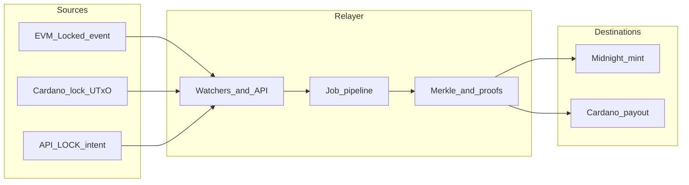

# Consolidated test report

**Scope:** This document summarizes automated checks (CI and unit-level tests), how the bridge and relayer fit together, and **documented** integration runs with transaction hashes on EVM, Cardano, and Midnight. It is a **prototype** narrative, not a security audit or mainnet sign-off.

**Last updated:** 2026-04-02 (integration figures from the run dated **2026-04-01** in [BRIDGE_TX_HASH_REPORT.md](BRIDGE_TX_HASH_REPORT.md)).

**Related:** [CHANGELOG.md](../CHANGELOG.md), [PROTOTYPE.md](PROTOTYPE.md), [USAGE.md](USAGE.md).

---

## How to read this document

| Section | What you get |
|---------|----------------|
| [Bridge process](#bridge-process-how-a-lock-becomes-a-job) | End-to-end flow and diagram |
| [Automated verification (CI)](#automated-verification-ci) | What GitHub Actions runs and which artifacts exist |
| [Automated tests (detail)](#automated-tests-detail) | Hardhat, Aiken, and TypeScript checks |
| [Integration: latest documented three-chain run](#integration-latest-documented-three-chain-run) | **Tx hashes**, addresses, relayer jobs |
| [Earlier documented run](#earlier-documented-run-evm--midnight-only) | Pointer to EVM + Midnight only |
| [Known gaps and failures](#known-gaps-and-failures) | Honest limits from local runs |
| [Reproduce and refresh](#reproduce-and-refresh) | Links to commands and CI downloads |

**Canonical hash tables and reproduce commands** for every field below also live in [BRIDGE_TX_HASH_REPORT.md](BRIDGE_TX_HASH_REPORT.md). Integration methodology and relayer settings are in [LOCAL_BRIDGE_INTEGRATION_REPORT.md](LOCAL_BRIDGE_INTEGRATION_REPORT.md). Cardano stack setup: [CARDANO_LOCAL_YACI.md](CARDANO_LOCAL_YACI.md). Production variable checklist: [SRS_RELAYER_REQUIREMENTS.md](SRS_RELAYER_REQUIREMENTS.md).

---

## Bridge process: how a lock becomes a job

Locks enter the relayer from three kinds of sources:

1. **EVM** — The pool emits a `Locked` event; the EVM watcher turns it into a job with an anchored `lockRef` such as `evm:<txHash>:<logIndex>`.
2. **Cardano** — UTxOs at the configured lock address (or demo setup) are observed; `lockRef` uses `cardano:<txHash>:<outputIndex>`.
3. **HTTP API** — `POST /v1/intents/lock` creates an intent with an `offchain:…` `lockRef` when there is no on-chain anchor yet.

The pipeline verifies inclusion (e.g. Merkle proofs against EVM logs), runs Midnight proof/mint steps when the destination is Midnight, or builds a Cardano payout transaction when the destination is Cardano. Jobs are tracked under `GET /v1/jobs` (with BigInt-safe JSON serialization).

---

## Automated verification (CI)

Workflow: [.github/workflows/ci.yml](../.github/workflows/ci.yml) on push and pull request to `main` / `master`.

| Step | Package / path | What it validates |
|------|----------------|-------------------|
| `npm ci` | Repository root | Workspace install with patches |
| Typecheck | `contract` (`@zk-stables/midnight-contract`) | TypeScript against committed Compact-managed exports |
| Typecheck | `zk-stables-relayer` | Relayer compiles |
| Typecheck | `zk-stables-ui` | UI compiles |
| `npm test` with `CI=true` | `evm` | Hardhat tests; writes JUnit (see below) |
| `aiken check` | `cardano/aiken` | Validator build + embedded unit tests; log captured |
| `npm run typecheck` | `cardano/ts` | Mesh / off-chain CLI TypeScript |

**Machine-readable outputs (not committed to git):** each run uploads a **`test-reports`** artifact containing `junit-evm.xml` and `aiken-check.log`. Download: GitHub → **Actions** → select run → **Artifacts**. Same layout is documented in [reports/README.md](reports/README.md).

**Snapshot counts** (current suite; confirm on your commit via CI or local commands in [reports/README.md](reports/README.md)):

- **EVM:** 2 passing Hardhat tests  
- **Aiken:** 1 passing unit test (`lock_datum_constructible`)

---

## Automated tests (detail)

### EVM (Hardhat)

| Suite | Test | Intent |
|-------|------|--------|
| `ZkStablesWrappedToken burn (mUSDC / mUSDT) + burnCommitment` | `mints mock wUSDC via bridge then burn emits Burned with burnCommitment` | Bridge mint path into wrapped token, then burn emits `Burned` with `burnCommitment` |
| `MerkleProof matches merkletreejs` | `verifies` | On-chain Merkle verify harness agrees with `merkletreejs` for a small tree |

### Cardano (Aiken)

| Test | Intent |
|------|--------|
| `lock_datum_constructible` | `LockDatum` constructs and decodes with expected amount and nonce ([`cardano/aiken/lib/tests.ak`](../cardano/aiken/lib/tests.ak)) |

### TypeScript (compile-only in CI)

CI **does not** start Anvil, Yaci, Midnight Docker, or the relayer. It only ensures these packages typecheck: Midnight contract TS surface, relayer, UI, and Cardano off-chain CLIs. End-to-end bridge behavior is covered under **Integration** (manual/local documented runs), not in the default CI job.

---

## Integration: latest documented three-chain run

**When:** 2026-04-01  
**Relayer port:** `8822`  
**Stacks:** Anvil `http://127.0.0.1:8545` (chainId **31337**), Yaci Store `http://127.0.0.1:8080/api/v1`, Midnight indexer `http://127.0.0.1:8088/api/v4/graphql`, proof-server `http://127.0.0.1:6300`, relayer `http://127.0.0.1:8822`.  
**Note:** `RELAYER_SRS_STRICT=false` for this dev run. SRS production expectations: [SRS_RELAYER_REQUIREMENTS.md](SRS_RELAYER_REQUIREMENTS.md).

### Cardano (Yaci devnet)

| Item | Value |
|------|--------|
| Pre-fund tx (utxo1 → bridge `changeAddress` for abandon mnemonic) | `d72589d1821994e87654424f13eadc0b17eae71499735dd18064c2f3273bb5d0` |
| Bridge wallet address (abandon mnemonic, Mesh / preview) | `addr_test1qq8ac7qqy0vtulyl7wntmsxc6wex80gvcyjy33qffrhm7sh927ysx5sftuw0dlft05dz3c7revpf7jx0xnlcjz3g69mqkt5dmn` |
| `POST /v1/intents/lock` LOCK → Cardano (operator payout) | `d3e07a75b88116781abcb578574a3c4cf6bcf39ca3df5e50e3ff687215318237` |
| Job id | `job_1775042694432_3a027874` |

Yaci Store: `GET /api/v1/txs/d3e07a75b88116781abcb578574a3c4cf6bcf39ca3df5e50e3ff687215318237`.

### EVM (Anvil)

| Item | Value |
|------|--------|
| Pool `lock()` tx (`integration-emit-lock.js`) | `0xd066fb81064e17470b1e7f412c374a38e940962af6cb10944fe2f76ae30028cf` |
| Block | `71` |
| `ZkStablesPoolLock` | `0xFD471836031dc5108809D173A067e8486B9047A3` |
| Mock USDC | `0x7bc06c482DEAd17c0e297aFbC32f6e63d3846650` |

Deploy artifact for that run: `/tmp/fulltest-addrs.json`.

### Midnight

| Item | Value |
|------|--------|
| Contract (from Cardano-watcher job hint) | `d278a6f30d97bd078facb80374ce9025213c166792cff4a49b38402e081e2542` |
| `mintWrappedUnshielded` txHash (Cardano → Midnight job) | `cd5bb44b02126986a253c36cac4c67e3942ac221ea60870124fd7d11b63311a9` |
| `mintWrappedUnshielded` txId | `00fced380a199a9f75057ce8d2fa09f5c6e0bab942f91b76a621a37e64a44b1b29` |

**Outcomes in that run:** EVM → Midnight job `job_1775042679328_dbf1e334` (`lockRef` `evm:0xd066fb81…:1`) **failed** on the Midnight step (`Database failed to open` in the local wallet / SQLite environment). Cardano lock watcher → Midnight job `job_1775042703056_39f9e2f7` **completed**; `proveHolder` logged the same DB error in `destinationHint`, but **`mintWrappedUnshielded` succeeded** (ids above).

### Relayer jobs (same run)

| Job id | Route | `lockRef` | Phase | Notes |
|--------|--------|-----------|-------|--------|
| `job_1775042694432_3a027874` | API LOCK → **Cardano** | `offchain:…` | `completed` | `Cardano payout tx: d3e07a75…` |
| `job_1775042679328_dbf1e334` | EVM watcher → **Midnight** | `evm:0xd066fb81…:1` | `failed` | Merkle proof OK; Midnight DB error |
| `job_1775042703056_39f9e2f7` | Cardano watcher → **Midnight** | `cardano:d3e07a75…:0` | `completed` | UTxO from payout; mint tx above |

**Watcher caveat:** `RELAYER_CARDANO_LOCK_ADDRESS` matched the demo bech32 used as `RELAYER_BRIDGE_CARDANO_RECIPIENT`, so the payout output was visible to the lock watcher. For production, use a **dedicated** lock script address.

---

## Earlier documented run (EVM + Midnight only)

**Relayer port 8811**, no Cardano indexer. Summary: EVM pool `lock()` tx `0xdfadedc9c10697680fdb675bd68bc0f291978fbe2d82346e431edbeaf7acdf1a` (block 49); Midnight contract `d4eacd70f8c66fc2f1d15fafdd799844404ca9ba0d95c6a0c6c5053ecd1e938f`; `proveHolder` / `mintWrappedUnshielded` hashes and completed job `job_1775041748006_13a11754` in [BRIDGE_TX_HASH_REPORT.md](BRIDGE_TX_HASH_REPORT.md) (section *Earlier run*).

---

## Known gaps and failures

| Area | What happened | Source |
|------|----------------|--------|
| Midnight wallet / SQLite | `Database failed to open` on one EVM→Midnight path; `proveHolder` logged DB error in hints on another path while mint still succeeded | [BRIDGE_TX_HASH_REPORT.md](BRIDGE_TX_HASH_REPORT.md) |
| Midnight dust | Local `deployContract` failed with insufficient dust until wallet funded (`fund-and-register-dust` flow) | [LOCAL_BRIDGE_INTEGRATION_REPORT.md](LOCAL_BRIDGE_INTEGRATION_REPORT.md) |
| Anvil confirmations | Default `RELAYER_EVM_CONFIRMATIONS=1` can skip the lock block on a quiet chain; use `0` locally or mine ahead | [LOCAL_BRIDGE_INTEGRATION_REPORT.md](LOCAL_BRIDGE_INTEGRATION_REPORT.md) |
| Cardano bridge wallet | Must fund Mesh-derived address (e.g. 50 ADA from Yaci `utxo1`) or `Cardano payout tx` cannot be built | [BRIDGE_TX_HASH_REPORT.md](BRIDGE_TX_HASH_REPORT.md) |
| CI vs integration | CI does not run Compact compile, local stacks, or relayer e2e | This document, [.github/workflows/ci.yml](../.github/workflows/ci.yml) |

---

## Reproduce and refresh

| Goal | Where to look |
|------|----------------|
| Three-chain dev (Yaci + Anvil + Midnight), relayer **8822** | [BRIDGE_TX_HASH_REPORT.md](BRIDGE_TX_HASH_REPORT.md) — section **Reproduce** |
| EVM + Midnight only (**8811**) | Same file, **Earlier run** subsection |
| Relayer env and commands | [LOCAL_BRIDGE_INTEGRATION_REPORT.md](LOCAL_BRIDGE_INTEGRATION_REPORT.md), [zk-stables-relayer/.env.integration.example](../zk-stables-relayer/.env.integration.example) |
| Yaci + Cardano relayer wiring | [CARDANO_LOCAL_YACI.md](CARDANO_LOCAL_YACI.md) |
| Latest JUnit + Aiken log for a commit | GitHub **Actions** artifact `test-reports` — [reports/README.md](reports/README.md) |
| Local parity with CI | [USAGE.md](USAGE.md) — **CI parity (local)** |

To stop a dev relayer bound to a port: `fuser -k <port>/tcp` (e.g. `8822`).

---

*For a single source of truth on hashes over time, update [BRIDGE_TX_HASH_REPORT.md](BRIDGE_TX_HASH_REPORT.md) when you run new integration passes; this file can be refreshed to match.*
