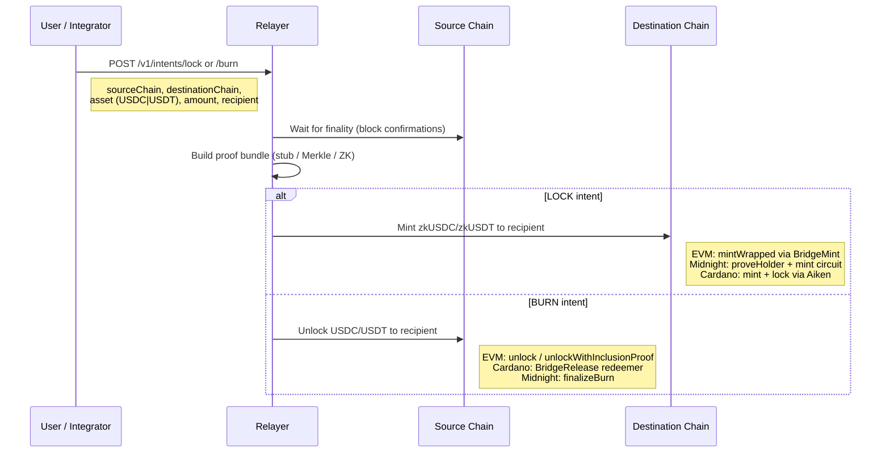

# Bridge Swap Flow

This document describes **how cross-chain "swaps" are meant to work** in ZK-Stables: each rail holds **USDC / USDT** (or a local mock), movement is **proven**, and the destination issues **zkUSDC / zkUSDT** -- tokens that exist **only after validation**, not as a traditional same-chain "wrap the underlying in a vault" product.

## Roles of Assets

| Layer | Canonical Stables | After Validated Bridge Mint |
|-------|-------------------|------------------------------|
| **EVM (demo)** | Mock **mUSDC** / **mUSDT** (`MockERC20`) -- stand-ins for chain-native USDC/USDT | **zkUSDC** / **zkUSDT** -- ERC20s minted only by `ZkStablesBridgeMint` after verifier + nonce (see [`ZkStablesWrappedToken`](https://github.com/dextrlabs-dev/ZK-Stables-USDC-USDT-Non-Custodial-Bridge/blob/main/evm/contracts/ZkStablesWrappedToken.sol); the type name is historical) |
| **Midnight** | Underlying intent / shielded state in the **zk-stables** Compact contract | Ledger balances updated by **circuits** (`proveHolder`, mint/burn paths) -- the "zk" stable representation on that network |
| **Cardano** | Native assets under a forge policy + **lock\_pool** / **unlock\_pool** validators | Minted native units (policy + token name) locked/released per Aiken logic + Mesh; conceptually the Cardano zk-stable rail |

**Summary:** **USDC/USDT** (or mocks) are the **source-of-funds / accounting** on a given chain; **zkUSDC/zkUSDT** (or the Midnight/Cardano equivalents) are the **destination representation after the bridge accepts a proof (or stub) and mints**.

## Canonical Product Flow (EVM-First)

1. **Mint (bridge out):** User locks **USDC / USDT** on **EVM** (`ZkStablesPoolLock` + relayer path). The destination (**Cardano** or **Midnight**) receives **zkUSDC / zkUSDT** (verified mint / native zk per rail). HTTP `POST /v1/intents/lock` accepts **`sourceChain: "evm"`** only; Cardano-originated locks are still discoverable via **`RELAYER_CARDANO_WATCHER_ENABLED`** when operators enable that watcher.

2. **Redeem (bridge back):** User burns **zkUSDC / zkUSDT** on **Cardano** or **Midnight** (or burns zk on EVM for same-chain redeem). **Underlying USDC / USDT is claimed on EVM** -- relayer calls **`ZkStablesPoolLock.unlock`** (operator binding) for Cardano/Midnight burns when `recipient` is a `0x` address and env is configured; EVM-sourced burns use **`unlockWithInclusionProof`** when a Merkle proof is present.

## End-to-End Intent Shape

### Intent Processing Steps

1. **User / integrator** submits a **LOCK** or **BURN** intent to the relayer (`POST /v1/intents/lock` or `/burn`) with `sourceChain`, `destinationChain`, `asset` (`USDC` | `USDT`), `amount`, and `recipient` on the **destination** rail (for LOCK) or **EVM payout address** (for BURN from Cardano/Midnight).

2. **Finality** -- relayer waits for source confirmations (EVM blocks, Cardano height via Yaci/Blockfrost, or a dev stub delay).

3. **Proof bundle** -- today the demo often uses a **stub** or **merkle-inclusion** proof; production would use the full ZK stack. The important invariant: **no destination mint without passing verification** (`ZkStablesBridgeMint` calls `verifier.verify`; Midnight runs Compact circuits; Cardano spends follow validator rules).

4. **Destination handoff** -- per chain:
   - **EVM -> EVM / other**: `mintWrapped` on the bridge mint contract credits **zkUSDC/zkUSDT** to the recipient.
   - **-> Midnight**: relayer runs **Midnight** pipeline (e.g. `proveHolder`, `mintWrappedUnshielded`) so shielded/unshielded ledger reflects the amount.
   - **-> Cardano**: **mint + lock + release** (or release-only for burns sourced on Cardano) via Aiken `lock_pool` and Mesh.

**BURN** on a destination is the inverse story: destroy the **zk** representation on one rail and unlock or pay out **USDC/USDT** (or equivalent) on another, again after proofs and replay protection (e.g. `burnCommitment` on EVM).

Canonical field mapping per chain: [Burn Anchor Specification](burn-anchor-spec.md).

## Why Not Call Destination Tokens "Wrapped"

In many bridges, "wrapped USDC" means **this chain's IOU** backed by locked canonical USDC. Here, the EVM contracts are named `ZkStablesWrappedToken` for historical reasons, but the **intended product semantics** are:

- **zkUSDC / zkUSDT** = **verified bridge issuance** on that chain, not "I deposited USDC in the same chain and got a receipt."
- Underlying **locks** on EVM use **`ZkStablesPoolLock`** and merkle/event paths; **mint to recipient** goes through **`ZkStablesBridgeMint`** only after `verify`.

Local Anvil deploy uses symbols **zkUSDC** / **zkUSDT**; env keys may still say `wUSDC` / `wUSDT` in JSON for script compatibility.

## Where to Look in Code

| Concern | Location |
|---------|----------|
| EVM lock / burn events | [`ZkStablesPoolLock.sol`](https://github.com/dextrlabs-dev/ZK-Stables-USDC-USDT-Non-Custodial-Bridge/blob/main/evm/contracts/ZkStablesPoolLock.sol), [`ZkStablesWrappedToken.sol`](https://github.com/dextrlabs-dev/ZK-Stables-USDC-USDT-Non-Custodial-Bridge/blob/main/evm/contracts/ZkStablesWrappedToken.sol) |
| EVM verified mint | [`ZkStablesBridgeMint.sol`](https://github.com/dextrlabs-dev/ZK-Stables-USDC-USDT-Non-Custodial-Bridge/blob/main/evm/contracts/ZkStablesBridgeMint.sol), [`BridgeVerifierMock.sol`](https://github.com/dextrlabs-dev/ZK-Stables-USDC-USDT-Non-Custodial-Bridge/blob/main/evm/contracts/BridgeVerifierMock.sol) |
| Relayer orchestration | [`runJob.ts`](https://github.com/dextrlabs-dev/ZK-Stables-USDC-USDT-Non-Custodial-Bridge/blob/main/zk-stables-relayer/src/pipeline/runJob.ts) |
| Midnight contract + UI | [`contract/`](https://github.com/dextrlabs-dev/ZK-Stables-USDC-USDT-Non-Custodial-Bridge/blob/main/contract/), [`zk-stables-ui/`](https://github.com/dextrlabs-dev/ZK-Stables-USDC-USDT-Non-Custodial-Bridge/blob/main/zk-stables-ui/), [`local-cli/`](https://github.com/dextrlabs-dev/ZK-Stables-USDC-USDT-Non-Custodial-Bridge/blob/main/local-cli/) |
| Cardano validators + CLI | [`cardano/aiken/`](https://github.com/dextrlabs-dev/ZK-Stables-USDC-USDT-Non-Custodial-Bridge/blob/main/cardano/aiken/), [`cardano/ts/`](https://github.com/dextrlabs-dev/ZK-Stables-USDC-USDT-Non-Custodial-Bridge/blob/main/cardano/ts/) |

## Related

- [System Overview](system-overview.md) -- high-level architecture and trust model
- [Deposit Commitment Encoding](deposit-commitment-encoding.md) -- canonical 32-byte commitment spec
- [Burn Anchor Specification](burn-anchor-spec.md) -- how burn intents anchor to on-chain evidence
- [Prototype Status](../overview/prototype-status.md) -- scope and limitations

---

Source: [`docs/BRIDGE_SWAP_FLOW.md`](https://github.com/dextrlabs-dev/ZK-Stables-USDC-USDT-Non-Custodial-Bridge/blob/main/docs/BRIDGE_SWAP_FLOW.md)
