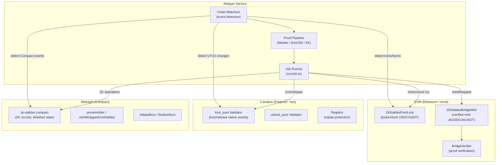
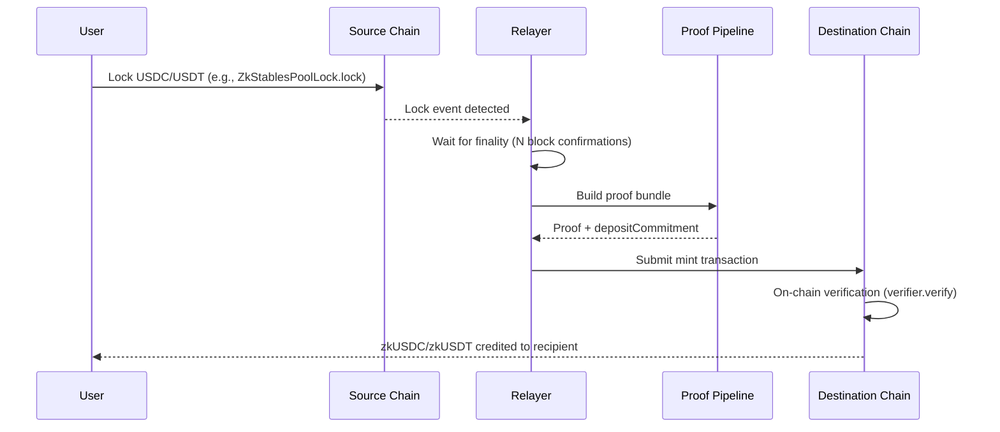
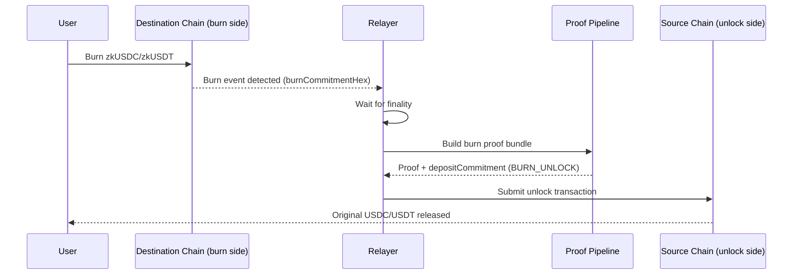

# System Overview

This page describes the high-level architecture of the ZK-Stables bridge: how the three chains interconnect, what the relayer does, and how proofs flow through the system.

## Three-Chain Topology

The bridge connects three blockchain ecosystems through a central relayer service. Each chain has its own smart contract layer for holding or issuing assets, and the relayer orchestrates cross-chain communication.

## LOCK Lifecycle (Deposit and Mint)

The LOCK flow moves stablecoins from a source chain to a destination chain by locking the original asset and minting a verified representation.

**Step by step:**

1. **User locks** stablecoins on the source chain. On EVM this calls `ZkStablesPoolLock`; on Cardano this creates a UTxO at the `lock_pool` validator.
2. **Relayer detects** the lock event via chain watchers (EVM event logs, Cardano UTxO indexing via Yaci/Blockfrost, or Midnight transaction monitoring).
3. **Finality wait** -- the relayer waits for configurable block confirmations to ensure the source transaction is final.
4. **Proof construction** -- the proof pipeline builds a chain-specific proof bundle and computes the `depositCommitment` (see [Deposit Commitment Encoding](deposit-commitment-encoding.md)).
5. **Destination mint** -- the relayer submits the proof and mints on the destination:
   - **EVM**: `ZkStablesBridgeMint.mintWrapped` (calls `verifier.verify` first)
   - **Midnight**: runs `proveHolder` / `mintWrappedUnshielded` via Compact circuits
   - **Cardano**: mint native assets + lock at `lock_pool` via Aiken + Mesh

## BURN Lifecycle (Redeem and Unlock)

The BURN flow is the inverse: destroy the wrapped representation on one chain and unlock the original stablecoins on another.

**Step by step:**

1. **User burns** the wrapped token. On EVM this calls `ZkStablesWrappedToken.burn`; on Cardano the lock UTxO is spent with a `BridgeRelease` redeemer; on Midnight the holder calls `initiateBurn`.
2. **Relayer detects** the burn and captures the `burnCommitmentHex` (see [Burn Anchor Specification](burn-anchor-spec.md)).
3. **Proof construction** -- builds a proof with `operation_type = BURN_UNLOCK`.
4. **Source unlock** -- the relayer unlocks on the source chain:
   - **EVM**: `ZkStablesPoolLock.unlock` (operator binding) or `unlockWithInclusionProof` (Merkle proof)
   - **Cardano/Midnight**: corresponding release/finalize transactions

## Trust Model

### What is verified on-chain

- **Proof validity** -- EVM's `ZkStablesBridgeMint` calls `verifier.verify` before minting. Midnight runs full ZK circuits. Cardano validators enforce datum and redeemer rules.
- **Replay protection** -- nonce tracking on EVM, datum-level uniqueness on Cardano, per-ticket deployment or registry maps on Midnight.
- **Amount and asset consistency** -- the `depositCommitment` encodes amount, asset code, source/destination chain IDs, and nonces; on-chain contracts validate these match.

### What the relayer handles

- **Event detection** -- watching chains for lock/burn events.
- **Finality determination** -- waiting for sufficient block confirmations before acting.
- **Proof construction** -- assembling the cryptographic proof bundle from on-chain data.
- **Transaction submission** -- submitting mint/unlock transactions to destination/source chains.

The relayer is an **automation layer**, not a custodian. It cannot mint without passing on-chain verification or unlock without a valid proof.

## Proof Pipeline

The proof pipeline adapts to each chain's capabilities:

| Chain | Proof Type | Description |
|-------|-----------|-------------|
| **EVM** | Merkle inclusion | Merkle proof of the lock/burn event log against the block's receipts trie |
| **Cardano** | Stub-SHA256 | SHA-256 hash of the lock UTxO datum fields; full ZK integration is a future milestone |
| **Midnight** | ZK circuits | Full zero-knowledge proofs via Compact (`proveHolder`, mint/burn circuit paths) |

All proof types produce a 32-byte `depositCommitment` that anchors the cross-chain operation. See [Deposit Commitment Encoding](deposit-commitment-encoding.md) for the canonical construction.

## Finality Awareness

The relayer is finality-aware with configurable block confirmations per chain:

- **EVM**: configurable number of block confirmations (default varies by network)
- **Cardano**: height-based confirmation via Yaci DevKit or Blockfrost indexer
- **Midnight**: dev stub delay or transaction confirmation from the Midnight node

The relayer will not begin proof construction until the source-chain event has reached the configured finality threshold.

## Related

- [Bridge Swap Flow](bridge-swap-flow.md) -- detailed asset roles and product flow
- [Deposit Commitment Encoding](deposit-commitment-encoding.md) -- canonical 32-byte commitment spec
- [Burn Anchor Specification](burn-anchor-spec.md) -- how burn intents anchor to on-chain evidence
